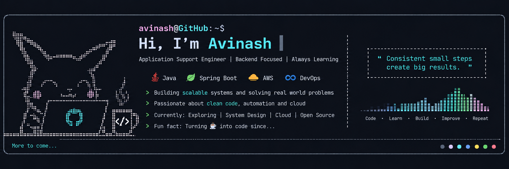

<div align="center">

</div>

---

<p align="center">
  
</p>

<div align="center">
  <a href="mailto:avinash.menon.in@gmail.com">
    
  </a>
  <a href="https://linkedin.com/in/avinash-io/">
    
  </a>
  <a href="https://linkedin.com/in/avinash-io/">
    
  </a>
</div>

---

<!-- Typing SVG Header -->

[](https://github.com/avinash-io)

- 💼 Application Support Engineer — FinTech & Media Analytics
- ☕ Java & Spring Boot enthusiast
- 🐳 Docker + DevOps enjoyer
- 🚀 Exploring cloud-native & distributed systems
- 🤝 Always open to building, learning & collaborating

---

[](https://github.com/avinash-io)

- 🔭 Building **Java / Spring Boot** applications
- 🌱 Learning **Kubernetes** and **System Design**
- 🐳 Exploring **containerized** and **cloud-native architectures**
- 📚 Practicing **Java 17+**, DSA, and backend engineering concepts

---

[](https://github.com/avinash-io)

```text
┌─ What can we talk about?
│
├── ☕ Java & Spring Boot
├── 🐳 Docker & DevOps
├── ☁️ Cloud & distributed systems
├── 🛠️ Application Support
├── 🧩 System Design
└── 💡 Anything interesting
```

💬 **Have a question or want to discuss something?**  
→ [Open an issue](https://github.com/avinash-io/avinash-io/issues)

---

[](https://git.io/typing-svg)

<p align="center">
  
  <br>
  
</p>

---

[](https://github.com/avinash-io)

<table>
  <tr align="center">
    <td>
      
    </td>
    <td>
      
    </td>
  </tr>
</table>

---
